<!--
  SETUP
  1. This file goes in your special profile repo:  github.com/imajij/imajij  →  README.md
  2. Create an `assets/` folder in that same repo and add:  header.svg  and  divider.svg
  3. GitHub renders animated SVGs natively — no external services needed for the banner.
-->

<div align="center">
  
</div>

<div align="center">
  
</div>

<div align="center">
  <a href="https://cracked-ajij.vercel.app"></a>
  <a href="https://linkedin.com/in/ajij-uttam"></a>
  <a href="mailto:ajijuttam2006@gmail.com"></a>
</div>

<br/>

## 📡 IDENTIFICATION SCAN

```text
ajij@arch ~/mission-control
❯ ./scan --deep --target "unidentified engineer"

  [ lifeform identified ............ ████████████ 100% ]

  CALLSIGN ......... imajij
  CLASS ............ software engineer — rust · full-stack · genAI
  BASE ............. Bengaluru, IN
  ACTIVE OP ........ rust backend & devops @ symbiotes.ai
  PRIOR SORTIES .... pipecode.ai · MegaLLM · stealth AI startup
  ALLIANCE ......... dora-rs — open-source robotics dataflow (Rust)
  ACADEMY .......... B.Sc. Computer Science — BITS Pilani × Scaler
  THREAT LEVEL ..... ships to production
  STATUS ........... [ ONLINE ] open to SDE internships
```

<div align="center">
  
</div>

## 🛸 THE HANGAR — flagship builds

| VESSEL | CLASS | STACK | FLIGHT RECORD |
|:--|:--|:--|:--|
| **[typeahead](https://github.com/imajij/typeahead)** | ⚡ Interceptor | `Rust` `Axum` `Tokio` `SQLite` | Google-style autocomplete from an in-memory trie — **p99 ~1.4 ms**, typo-tolerant (Damerau-Levenshtein), background write-batching cuts SQLite fsyncs **~50×** |
| **render-farm** | 🛡️ Carrier | `Next.js` `TypeScript` `Postgres` `Supabase` | Distributed video-generation platform — brokerless job queue on **SKIP LOCKED**, **RLS-only** authorization (zero DB creds in the web tier, 21 adversarial tests), crash-tolerant recovery for 2–4 h jobs |
| **[talking_pipeline](https://github.com/imajij/talking_pipeline)** | 🛸 Mothership | `Python` `Modal` `ComfyUI` `H100` | Self-hosted talking-avatar video generation on serverless GPUs — open diffusion models + custom LoRAs, **near-zero** per-video cost vs paid tools |
| **[intern-wire](https://github.com/imajij/intern-wire)** | 🛰️ Recon Drone | `Python` `FastAPI` `Docker` | Internship radar scraping LinkedIn + X with no login — 8-hour auto-refresh, stale-listing purge, URL-based dedup, token-gated admin |

## 🤝 ALLIED OPERATIONS — open source

> **[dora-rs/dora](https://github.com/dora-rs/dora)** — open-source Rust dataflow framework for AI-based robotics

- **[PR #2039](https://github.com/dora-rs/dora/pull/2039) · merged** — fixed a daemon-reconnection regression that killed running dataflows whenever the coordinator restarted; bounded retry window with unit-tested reconnect logic
- **[PR #2026](https://github.com/dora-rs/dora/pull/2026) · merged** — Arrow round-trip tests for four safety-critical MAVLink2 vehicle-command messages; distinct per-field sentinels catch silent field-transposition bugs

<div align="center">
  
</div>

<h2 align="center">⚔️ THE ARMORY</h2>

<div align="center">
  
  <br/>
  
</div>

<h2 align="center">📊 FLIGHT DATA</h2>

<div align="center">
  
  
</div>

<div align="center">
  
</div>

<br/>

<div align="center">

```text
                  .  *        ✦         .          *
         ✦                 _____                ✦
                       .-'´     `'-.
                    .-'  o   o   o  '-.
              ~==<{=====================}>==~
                    '-._____________.-'
                        \    · ·    /
                         \   · ·   /
                          \  · ·  /
                           \ · · /
                            \ · /
                             \·/

        ── END OF TRANSMISSION ── ajij@arch signing off ──
           « we come in peace. we also ship to prod. »
```

  

</div>
